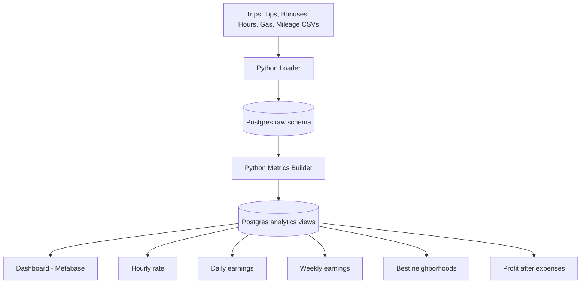

# Uber Earnings Analytics Architecture

## Pipeline Components
- Data ingestion: [etl/load_uber_data.py](etl/load_uber_data.py)
- Raw schema/tables: [sql/init/001_init.sql](sql/init/001_init.sql)
- Metrics builder: [etl/build_uber_metrics.py](etl/build_uber_metrics.py)
- Dashboard queries: [config/dashboard_queries.sql](config/dashboard_queries.sql)

## Metric Logic
- Hourly rate: $profit\_after\_expenses / hours\_worked$
- Daily earnings: Sum of trip earnings + tips + bonuses per day
- Weekly earnings: Weekly rollup from daily metrics
- Best neighborhoods: Rank by total profit after expenses
- Profit after expenses: Gross earnings minus gas and mileage costs
