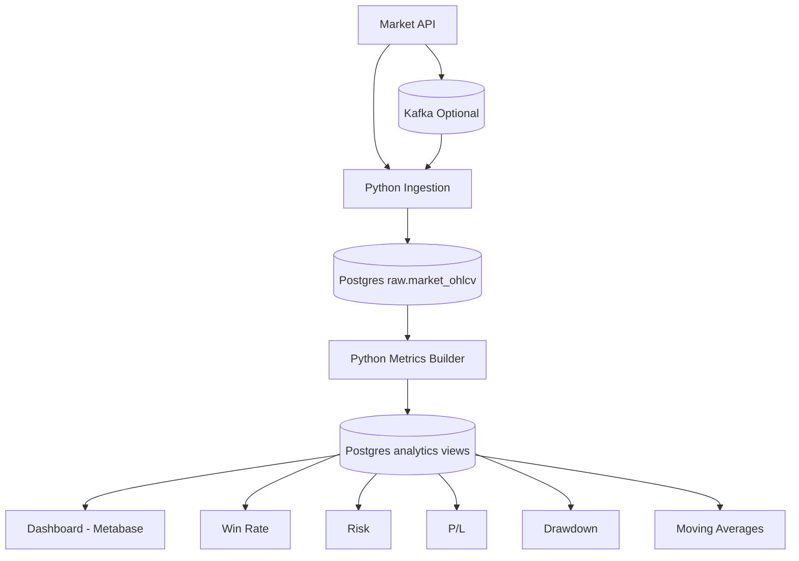

# Trading Pipeline Architecture

## Pipeline Components
- Market API ingest script: [etl/load_market_data.py](etl/load_market_data.py)
- Postgres init schema: [sql/init/001_init.sql](sql/init/001_init.sql)
- Metric builder script: [etl/build_trading_metrics.py](etl/build_trading_metrics.py)
- Runtime stack and optional Kafka profile: [docker-compose.yml](docker-compose.yml)

## Metric Definitions
- Win rate: Percentage of profitable strategy bars where $pnl > 0$
- Risk: Standard deviation of bar-level P/L
- P/L: Cumulative and per-bar strategy profit/loss
- Drawdown: $equity - running\_max(equity)$
- Moving averages: 5-period and 20-period simple moving averages
